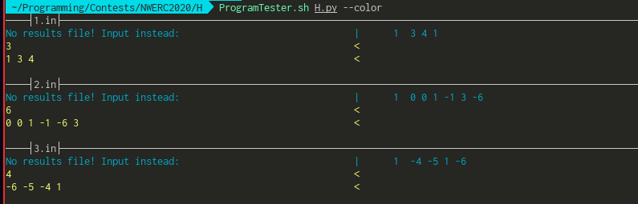
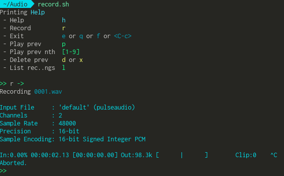

# Miscellaneous scripts too small for their own repository

## ProgramTester.sh

Tests Python/C++ programs on test cases in the same folder that end with `.in`. 
Shows the difference between test cases and `.out` files which represent the correct answer.



Usage:

```
ProgramTester.sh A.py
```
 
in a folder which contains the files `A.py`, `1.in`, `2.in`, etc.
Alternatively bind in Vim (or your editor of choice) to some key, here *return* is used:

```
nnoremap <CR> :w<CR>:!/absolute/file/path/ProgramTester.sh %<CR>
```

## record.sh

Interactive CLI-tool for recording audio, quickly play back or delete previous recording, quickly add new recordings.



## share_over_http.sh

A short script for sharing file(s) over http. 
Creates symlinks (`ln -s`) for the files given over the command line in a new folder in `/tmp`.
Starts a http server with python in that `/tmp` folder on port 12345. 
Then it creates a reverse tunnel to a `$REMOTE_SERVER`, with the same port there as well.
There an apache server with a proxy rule is set-up:

```
ProxyPass / http://localhost:12345/
ProxyPassReverse / http://localhost:12345/
```

Now the download link may have its own domain name and is accessible via https.

## check-battery.sh

Script for sending system notifications when the battery is low. Simply start it at system start.
Make sure `/usr/bin/notify-send` is available. Is a bit naive, it pings you every minute, but
this way you won't forget (certainly has not happened before). 
